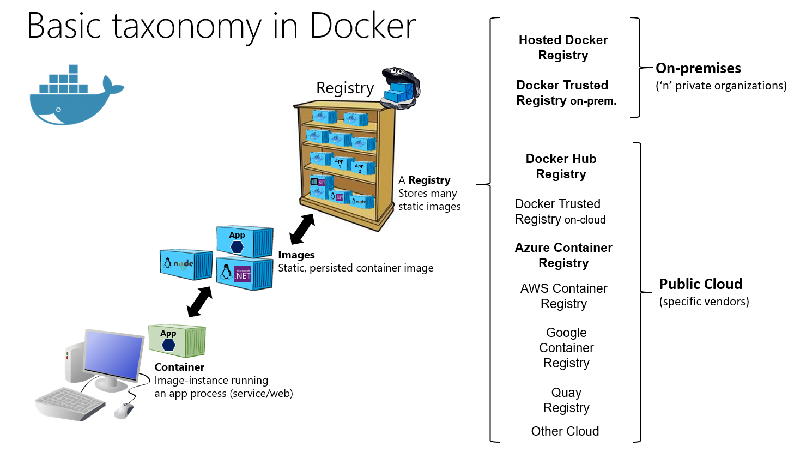

# docker
docker tutorial

# Docker for Linux
## linux 환경 설정 
- VirtualBox 를 이용하여 Ubuntu 설치 
    - Ubuntu 설치, [Download](https://ubuntu.com/download/desktop)
    - Hyper-V 옵션 비활성화, [Microsoft Docs](https://docs.microsoft.com/ko-kr/virtualization/hyper-v-on-windows/quick-start/enable-hyper-v)
    ```sh
    # Hyper-V 옵션 상태
    dism.exe /Online /Get-FeatureInfo:Microsoft-Hyper-V
    # Hyper-V 옵션 켜기
    dism.exe /Online /Enable-Feature:Microsoft-Hyper-V
    # Hyper-V 옵션 끄기
    dism.exe /Online /Disable-Feature:Microsoft-Hyper-V
    ```
## linux 명령어/단축키 
- **ctrl + alt + t** : 터미널 실행
- **ctlr + l** : 터미널에서 사용시 clean 명령어 실행, clean 명령어의 hotkey
- docker 설치 
```sh
# 관리자 권한
sudo -i
# docker 설치
apt install docker.io
# os 재시작, ubuntu update 가 background 에서 돌아가고 있을 os 재시작 후 설치 가능 
reboot
# 현재 디렉터리
$PWD
```

# Docker for Windows
## 참고문서
- Docker for Window, [Microsoft Docs](https://docs.microsoft.com/ko-kr/virtualization/windowscontainers/quick-start/set-up-environment?tabs=Windows-10-Client)

## Docker 실행 
1. Docker Desktop 을 실행 
2. Window Containers 를 실행 ('Switch to Linux Containers...' 이 나오면 된다.)
3. Docker Volume Folder 에서 PowerShell 실행 
4. docker ps -a : image 검색 
5. docker exec -it win1903 powershell : powershell 을 이용하여 docker image 실행 

## Docker Command 
- & .\CIM.exe -cli TEST.xml : cim 에서 cli 모드로 test 실행 

## Dockerfile 작성 
원하는 텍스트 편집기를 사용하여 Dockerfile을 연 후 다음 콘텐츠를 추가합니다. 

```dockerfile
FROM mcr.microsoft.com/dotnet/core/sdk:2.1 AS build-env
WORKDIR /app
```
컨테이너를 빌드하는데 사용할 기반이 되는 기본 이미지를 선언합니다. 로컬 시스템에 이 이미지가 없으면 docker가 자동으로 이미지를 가져오려고 시도합니다. 다음 명령은 컨테이너의 작업 디렉터리를 /app로 변경하므로 이 다음에 오는 모든 명령이 이 컨텍스트에서 실행됩니다. 

```dockerfile
COPY *.csproj ./
RUN dotnet restore
```
.csproj 파일을 **build-env** 컨테이너의 **/app** 디렉터리로 복사합니다. 이 파일을 복사하면 .NET이 이 파일을 읽은 후 프로젝트에 필요한 모든 종속성과 도구를 가져옵니다. 

```dockerfile
COPY . ./
RUN dotnet publish -c Release -o out 
```

# 도커와 컨테이너 소개 
## 아키텍쳐(Architecture)
- VMs : Hyper-v 기능을 사용해서 하드웨어를 추상화 시켜서 가성화를 구현한다.  
- Containter : 리눅스 컨트롤 그룹(cgroup), 리눅스 네임스페이스를 사용하여 가상화를 구현한다.


## 도커(Docker)
- 컨테이너 기술을 지원하는 다양한 프로젝트 중에 하나
- 컨테이너 기술은 이전에도 있었으나 도커로 인해 알려짐
- 컨테이너 기술의 사실상 표준
- 2014 가장 인기 있는 클라우드 오픈 소스 2위(리눅스 재단 발표)
- 다양한 운영체제에서 사용 가능(리눅스, 윈도우, MacOS)
- 애플리케이션에 국한 되지 않고 의존성 및 파일 시스템까지 패키징하여 빌드, 배포, 실행을 단순화
- 리눅스의 네임 스페이스와 cgroups와 같은 커널 기능을 사용하여 가상화

## 도커는 다양한 클라우드 서비스 모델과 같이 사용 가능 
- 이미지 : 필요한 프로그램과 라이브러리, 소스를 설치한 뒤 만든 하나의 파일
- 컨테이너 : 이미지를 격리하고 독립된 공간에서 실행한 가상 환경

## 컨테이너가 해결한다. 
- 동일 시스템에서 실행하는 소프트웨어의 컴포넌트가 충돌하거나 다양한 종속성을 가지고 있음
- 컨테이너는 가상머신을 사용해 각 마이크로 서비스를 격리(isolate)하는 기술 
- 컨테이너는 가상머신처럼 하드웨어를 전부 구현하지 않기 때문에 매우 빠른 실행 가능
- 프로세스의 문제가 발생할 경우 컨테이너 전체를 조정해야 하기 때문에 컨테이너에 하나의 프로세스를 실행하도록 하는 것이 좋다.
- 하이퍼바이저의 필요 없는 공간을 활용하면 더 많은 자원을 앱에 투자 가능

## 컨테이너를 격리하는 기술 
- 리눅스 네임스페이스 : 각 프로세스가 파일 시스템 마운트, 네트워크, 유저(uid), 호스트 네임(uts) 등에 대해 시스템에 독립 뷰를 제공 
- 리눅스 컨트롤 그룹 : 프로세스로 소비할 수 있는 리소스 양(CPU, 메모리, I/O, 네트워크 대역대, device 노드 등)을 제한 

## 도커의 한계
- 서비스가 커지면 커질 수록 관리해야 하는 컨테이너의 양이 급격히 증가
- 도커를 사용하여 관리를 한다 하더라도 쉽지 않은 형태
- 배포 및 컨테이너 배치 전략 
- 스케일-인, 스케일-아웃이 어려움

# 내가 원하는 이미지 찾기 : 도커 레지스트리 
도커 레지스트리에는 사용자가 사용할 수 있도록 데이터베이스를 통해 Image를 제공해주고 있음  
누구나 이미지를 만들어 푸시할 수 있으며 푸시된 이미지는 다른 사람들에게 공유 가능 



# Docker 이미지 검색 
Docker Hub 에서 이미지 검색 하거나 **docker search** 를 이용하여 검색하면 된다.

```sh
# 원하는 이미지 검색
docker search tomcat 
# Tomcat 설치 및 실행 
docker run -d -p 8080:8080 --name tc consol/tomcat-7.0
# 이미지만 다운
docker pull mysql
```

# 도커 라이프 사이클 이해하기 


```sh
# 도커 이미지 다운로드와 삭제
sudo docker pull consol/tomcat-7.0
sudo docker rmi consol/tomcat-7.0
# 톰캣 컨테이너 생성 및 실행
sudo docker run -d --name tc tomcat 
# 실행중인 컨테이너 확인
sudo docker ps 
# 모든 컨테이너 확인
sudo docker ps -a
# 컨테이너 실행
sudo docker start <container_name(container_id)>
# 컨테이너 중지
sudo docker stop <container_name(container_id)>
# 컨테이너 중지 
sudo docker rm <container_name(container_id)>
```
# 이미지 비밀 : 레이어 
## 레이어의 개념

- 이미지를 지운다 하더라도 다른곳에서 사용하고 있는 레이어는 지워지지 않음 
- 이미 존재하는 레이어는 새로 다운로드 받을 필요가 없음
```sh
# 도커 이미지 정보 확인
sudo docker pull nginx
sudo docker inspect nginx

# 도커 이미지 저장소 위치 확인 
sudo docker info 
## docker root dir
## storage driver : layer 저장소

# 도커 root 위치
sudo -i
cd <docker_root_dir>
## du -sh dir : dir 의 용량 확인
## ls -R dir : dir 의 모든 정보 조회

# 도커 히스토리 확인
docker history neginx
```

# 도커의 유용한 명령어 
```sh
# 포트포워딩으로 톰캣 실행하기
sudo docker run -d --name tc -p 80:8080 tomcat 
firefox 127.0.0.1:80

# 컨테이너 내부 셸 실행 
sudo docker exec -it tc /bin/bash

# 컨테이너 로그 확인 
sudo docker logs tc # stdout, stderr

# 호스트 및 컨테이너 간 파일 복사 
sudo docker cp <path> <to container>:<path>
sudo docker cp <from container>:<path> <path>
sudo docker cp <from container>:<path> <to container>:<path>

# 임시 컨테이너 생성
sudo docker run -d -p 80:8080 --rm --name tc tomcat

```

# 도커 컨테이너 실행 
```sh
# 기존에 설치된 모든 컨터이너와 이미지 정지 및 삭제 

# 컨테이너 id 만 출력
docker ps -q 
# 모든 컨테이너 id 만 출력
docker ps -a -q 
# 모든 컨터이너 종료 
docker stop `docker ps -a -q` 
# 모든 컨테이너 삭제 
docker rm `docker ps -a -q` 
# 모든 이미지 삭제
docker rmi `docker images -q` 

# 도커 기능을 사용해 jenkins 검색 
docker search jenkins

# jenkins를 사용하여 설치
docker pull jenkins
docker inspect jenkins # port 확인
docker run -d -p 8080:8080 --name jk jenkins

# jenkins 포트로 접속하여 웹 서비스 열기
firefox 127.0.0.1:8080 

# jenkins의 초기 패스워드 찾아서 로그인하기
docker exec -it jk cat <init_password_path>
## init_password_path에 초기 pw가 입력되어 있다. 
docker logs jk 
## log에 초기 pw가 출력된다.
```
# 환경 변수를 사용해 MySQL 서비스 구축
```sh
# 환경 변수 사용해 데이터 전달하기
docker run -d --name nx -e <env_name>=test1234 nginx 
## env_name : 환경 변수 이름 

# 환경 변수 상태 출력
docker exec -it nx bash
printenv <env_name>

# MySQL 서비스 구축하기 
docker run -d --name some-mysql -e MYSQL_ROOT_PASSWORD=qwer1234! mysql 
docker exec -it some-mysql mysql -u root -p 
## root_password 입력되면 mysql 이 실행됨
```

# 볼륨 마운트하여 Jupyter LAB 서비스 구축
- 명령어 형식
```sh
docker run -v <호스트 경로>:<컨테이너 내 경로>:<권한>
```
- 권한의 종류 
    - ro : 읽기 전용
    - rw : 읽기 및 쓰기

```sh
# nginx로 볼륨 마운트하기
sudo docker run -d -p 80:80 --rm --name nx -v /var/www:/usr/share/nginx/html:ro nginx
curl 127.0.0.1
echo 1234 > /var/www/index.html
curl 127.0.0.1

# 데이터 분석가를 위한 jupyter LAB 환경 구축하기 

mkdir ~/jupyternotebook
cd ~/jupyternotebook
sudo docker run --rm -p 10000:8888 -e JUPYTER-ENABLE-LAB=yes -v "$PWD":/home/jovyan/work:rw jupyter/datascience-notebook:9b06df75e445

# 디렉터리 권한설정 
chmod 777 <shared_directory>
## shared_directory root 권한주기
```

# 도커 빌드 
- 일반적인 실행
```sh
# test_server.py 생성
gedit test_server.py
```
```py
# test_server.py
import socket

with socket.socket() as s:
    s.bind(("0.0.0.0", 12345))
    s.listen()
    print("server is started")
    conn, addr = s.accept()
    # conn 클라이언트와 통신할 소켓
    # addr 클라이언트의 정보가 들어있음
    with conn:
        print("Connected by", addr)
        while True:
            data = conn.recv(1024)
            if not data: break
            conn.sendall(data)
```
```sh
# server 실행
python test_server.py
# client 실행
nc 127.0.0.1 12345
```
- dockerfile을 이용한 실행
```sh
# 도커 파일 생성
mkdir my_first_project
mv test_server.py ./my_first_project/
cd my_first_project/
gedit dockerfile            
```
```dockerfile
# dockerfile
# python 3.7 image 사용
FROM python:3.7 

# file 복사
RUN mkdir /echo # image 빌드할 때 
COPY test_server.py /echo

# python 실행
CMD ["python", "/echo/test_server.py"] # container 실행할 때
```
```sh
# 현재 폴더의 dockerfile을 빌드
docker build -t <tag_name> .
# server 실행
docker run -t -p 12345:12345 --name et --rm <tag_name>
```

# 도커 이미지 푸시 
```sh
# 이미지 태그 변경 후 푸시
docker login
docker tag echo_test <docker id/image_name>
docker images
docker push <docker id/image_name>
# 이미지 히스토리 확인 
docker history <docker id/image_name> 
## docker hub 에서 도커 이미지 확인
```
# 프라이베이트 레지스트리 구현 및 사용
```sh
# private registry 만들기
docker run -d --name docker-registry -p 5000:5000 registry
# 프라이베이트 레지스트리에 이미지 푸시하기
sudo docker tag echo_test 127.0.0.1:5000/echo_test
sudo docker push 127.0.0.1:5000/echo_test
```

# 워드프레스 도커 이미지 만들기 프로젝트
도커에서 제공하는 워드프레스와 MySQL은 따로 떨어진 형태로 존재한다. 여기서는 하나의 컨테이너에서 워드프레스와 MySQL을 동작시킬 수 있도록 만들어본다. 일단 가장 먼저 할 일은 PHP와 DB가 공존하는 환경을 찾는 것이다. 다양한 솔루션들이 있는데 그중에 XAMPP는 도커로 이미 만들어져있어 유용하게 사용할 수 있다. xampp는 apache, MariaDB, php가 설치돼 있다. 여기에 워드프레스만 올리면 바로 컨테이너를 만들 수 있다.  
먼저 도커 허브에서 다음 사이트를 찾아내자. [xampp](https://hub.docker.com/r/tomsik68/xampp)  
이 사이트를 컨테이너를 불러온 뒤 워드프레스 설치 과정을 진행하도록 한다. 컨테이너에서 SSH와 다양한 포트를 지원하지만 우리는 80포트만 사용할 예정이다.
```sh
sudo docker run --name wp -p 80:80 -d tomsik68/xampp
```
워드프레스 바로가기 : [wordpress](https://ko.wordpress.org/download/)  
```sh
# wget을 사용해 다운로드하고 푼다.
wget https://wordpress.org/latest.tar.gz
tar -xf latest.tar.gz 

# 컨테이너 내의 웹 파일 정리
sudo docker exec -it wp bash
chown daemon. /opt/lampp/htdocs
cd /opt/lampp/htdocs/
mkdir backup
mv * ./backup/
exit

# 워드프레스 파일을 컨테이너에 복사하고 웹 루트 디렉토리에 배치 
sudo docker cp wordpress wp:/opt/lampp/htdocs
sudo docker exec -it wp bash
cd /opt/lampp/htdocs/
mv /opt/lampp/htdocs/wordpress/* /opt/lampp/htdocs/
exit
sudo docker restart wp
```

